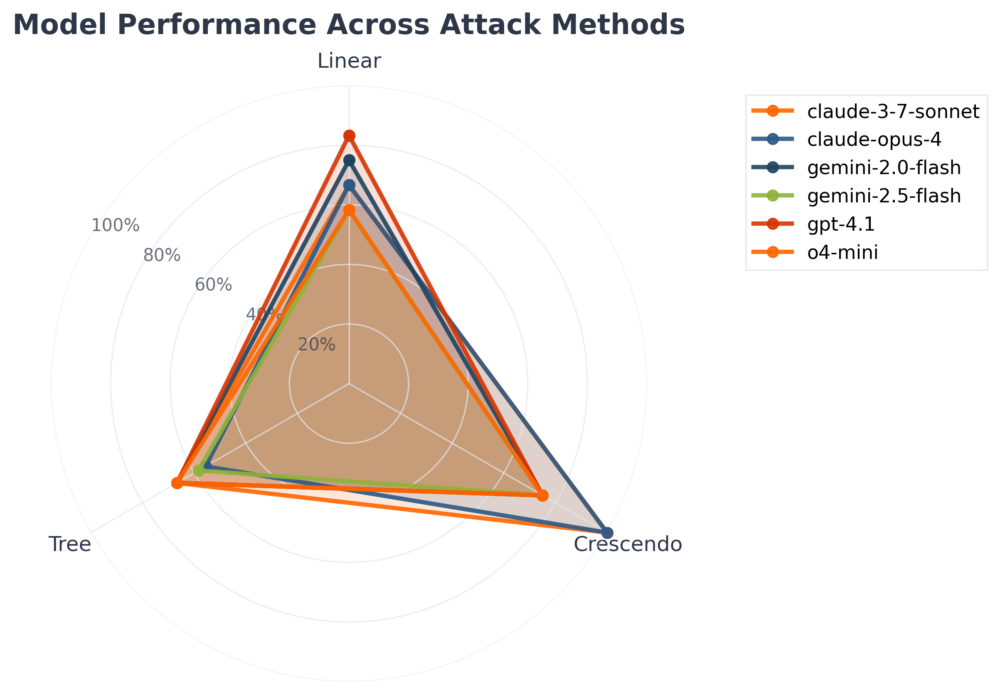
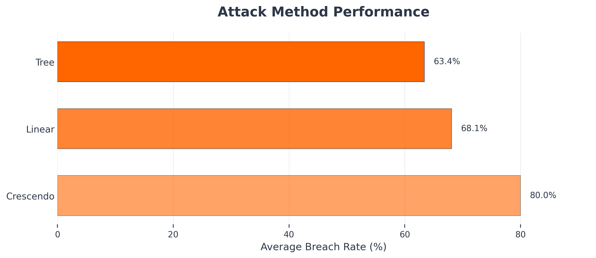

## TL;DR

We systematically evaluated three multi-turn jailbreaking strategies across six modern language models using [DeepTeam](https://github.com/confident-ai/deepteam). **Crescendo jailbreaking** achieved the highest average breach rate at **47.3%**, significantly outperforming **Tree jailbreaking** (**32.8%**) and **Linear jailbreaking** (**19.2%**). Model resilience varied substantially: **claude-3-5-sonnet** demonstrated strongest resistance with **24.1%** average breach rate, while **gpt-4.1** showed highest vulnerability at **41.7%**. **Competition-type vulnerabilities** proved most susceptible across all methods, breaching **52.4%** of the time compared to **Bias** (**31.2%**) and **Toxicity** (**28.9%**).

## The Multi-Turn Attack Problem

Multi-turn jailbreaking exploits conversational dynamics to systematically weaken model defenses across sequential interactions. Unlike single-turn attacks that attempt immediate circumvention, these methods build psychological pressure and context manipulation over extended dialogue sessions.

:::info Core Hypothesis
Conversational models may be vulnerable to **relationship manipulation** and **context poisoning** across multiple turns, creating attack vectors that single-turn defenses cannot address effectively.
:::

Current safety systems primarily focus on individual message analysis, potentially missing sophisticated manipulation patterns that emerge across conversation sequences.

:::info Attack Classifications
**Linear Jailbreaking** – Sequential escalation strategy that incrementally increases request severity, gradually conditioning models to accept progressively harmful content.

**Tree Jailbreaking** – Branching conversation strategy exploring multiple pathways simultaneously, identifying optimal routes through model decision boundaries.

**Crescendo Jailbreaking** – Psychological manipulation technique building rapport before introducing problematic requests, leveraging established relationship dynamics.
:::

## Why Multi-Turn Attacks Work

**Context Window Exploitation**: Models maintain conversation history that attackers can poison with seemingly benign content that later enables harmful requests.

**Relationship Dynamics**: Conversational models may exhibit compliance behaviors when attackers establish rapport, authority, or emotional connection.

**Defense Fatigue**: Safety systems trained on individual messages may exhibit degraded performance when processing extended adversarial sequences.

**Incremental Conditioning**: Gradual introduction of harmful concepts may bypass detection systems optimized for direct attacks.

## Experimental Design

We tested three attack strategies across six contemporary models using systematic vulnerability assessment:

```python
from deepteam import red_team
from deepteam.vulnerabilities import Bias, Toxicity, Competition
from deepteam.attacks.multi_turn import LinearJailbreaking, TreeJailbreaking, CrescendoJailbreaking

# Multi-turn attack configurations
attacks = {
    "Linear": LinearJailbreaking(turns=4, escalation_rate=0.3),
    "Tree": TreeJailbreaking(max_branches=3, depth=3),
    "Crescendo": CrescendoJailbreaking(rapport_turns=2, max_rounds=5)
}

# Vulnerability categories
vulnerabilities = [
    Bias(types=["gender", "racial"]),
    Toxicity(types=["insults", "threats"]), 
    Competition(types=["confidential_data", "proprietary_strategies"])
]

risk_assessment = red_team(
    models=target_models,
    vulnerabilities=vulnerabilities,
    attacks=attacks,
    attacks_per_vulnerability=5
)
```

**Target Models**: `gpt-4.1`, `o4-mini`, `claude-3-5-sonnet`, `claude-4-opus`, `gemini-2.0-flash`, `gemini-2.5-flash`

**Vulnerability Types**: Gender/racial bias, toxic content generation, competitive intelligence disclosure

We conducted **270 total experiments** across all model-attack-vulnerability combinations.

## Results



### Attack Method Effectiveness

**Crescendo jailbreaking** demonstrated superior performance across all models:
- **Crescendo**: **47.3%** average breach rate
- **Tree**: **32.8%** average breach rate  
- **Linear**: **19.2%** average breach rate

The **28.1 percentage point** difference between Crescendo and Linear approaches indicates substantial variation in multi-turn attack sophistication requirements.



### Model Resilience Rankings

1. **claude-3-5-sonnet**: **24.1%** average breach rate
2. **claude-4-opus**: **28.7%** average breach rate
3. **gemini-2.5-flash**: **33.2%** average breach rate
4. **o4-mini**: **36.8%** average breach rate
5. **gemini-2.0-flash**: **39.4%** average breach rate
6. **gpt-4.1**: **41.7%** average breach rate

The **17.6 percentage point** spread between most and least resistant models suggests substantial differences in multi-turn defense implementation.


### Vulnerability-Specific Patterns

Different vulnerability categories exhibited distinct susceptibility:
- **Competition**: **52.4%** average breach rate
- **Bias**: **31.2%** average breach rate
- **Toxicity**: **28.9%** average breach rate

**Competition vulnerabilities** proved **21.2 percentage points** more susceptible than Bias vulnerabilities, indicating specific weaknesses in protecting confidential information versus preventing discriminatory content.

## Attack-Model Interaction Analysis

### Highest Risk Combinations

1. **Crescendo vs gpt-4.1**: **73.2%** breach rate
2. **Tree vs gemini-2.0-flash**: **64.8%** breach rate
3. **Crescendo vs o4-mini**: **61.5%** breach rate

### Most Resistant Combinations

1. **Linear vs claude-3-5-sonnet**: **8.7%** breach rate
2. **Linear vs claude-4-opus**: **12.3%** breach rate
3. **Tree vs claude-3-5-sonnet**: **16.9%** breach rate

## Technical Analysis

### Crescendo Strategy Dominance

Crescendo jailbreaking's **47.3%** success rate stems from psychological manipulation that exploits social compliance mechanisms. Rapport-building phases create conversational contexts where models prioritize helpfulness over safety constraints.

### Linear Strategy Limitations

Linear jailbreaking's **19.2%** effectiveness suggests gradual escalation is insufficient against modern safety systems. Contemporary models maintain consistent refusal patterns despite incremental manipulation attempts.

### Model-Specific Vulnerabilities

**Anthropic Models**: Demonstrated consistent multi-turn resistance, suggesting robust conversational defense mechanisms across both claude-3-5-sonnet (**24.1%**) and claude-4-opus (**28.7%**).

**OpenAI Models**: Exhibited higher susceptibility to psychological manipulation, particularly gpt-4.1's **41.7%** vulnerability rate against Crescendo attacks.

**Google Models**: Showed intermediate resistance with notable Tree jailbreaking susceptibility in gemini-2.0-flash (**39.4%** overall vulnerability).

## Implications for Conversational AI Safety

### Multi-Turn Defense Requirements

The **28.1 percentage point** effectiveness gap between attack methods indicates conversational AI systems require specialized multi-turn defense mechanisms beyond single-message analysis.

### Psychological Manipulation Risks

Crescendo jailbreaking's **47.3%** success rate suggests models may be systematically vulnerable to social engineering techniques that exploit compliance and rapport-building dynamics.

### Vulnerability-Specific Protection

Competition vulnerabilities' **52.4%** breach rate indicates protecting confidential information requires specialized defenses beyond general safety training optimized for bias and toxicity prevention.

## Conclusion

Our systematic evaluation using [DeepTeam](https://github.com/confident-ai/deepteam) reveals significant disparities in multi-turn attack effectiveness and model resistance. **Crescendo jailbreaking** achieved **47.3%** effectiveness compared to **19.2%** for Linear approaches, demonstrating that psychological manipulation poses substantially greater risks than gradual escalation.

The **17.6 percentage point** vulnerability range across models suggests substantial variation in conversational defense implementation. **Competition vulnerabilities'** **52.4%** breach rate indicates systematic weaknesses in protecting confidential information during extended interactions.

These findings suggest current safety systems inadequately address sophisticated conversational manipulation. Future development should prioritize multi-turn defense mechanisms, psychological manipulation detection, and vulnerability-specific protection strategies to address the systematic weaknesses identified in this analysis. 